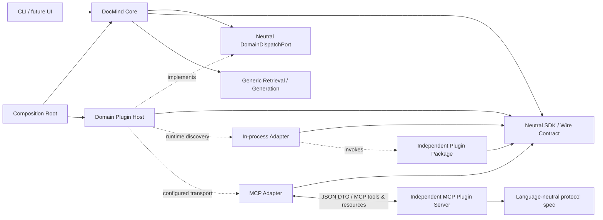

# ADR-0001: Domain Plugin Boundary and Future MCP Adapter

- 状态：Proposed
- 日期：2026-07-14
- 实施状态：协议 spike 与独立 Domain SDK protocol 1.0 已完成；空 Host 接入尚未开始
- 决策范围：领域能力边界、Host、SDK、进程内适配与未来 MCP 适配
- 非目标：本轮不迁移现有业务逻辑，不实现任何具体领域插件，不改变线上路由或回答行为

## 1. 决策摘要

DocMind 采用“通用 Core + 领域无关 Host + 中立 SDK/线协议 + 独立领域插件”的架构。

Core 只负责通用对话调度、Source 范围、序号选择、焦点交互和通用检索降级。Host 负责插件发现、协议校验、生命周期、超时、熔断、调用和降级。SDK 只定义可序列化 DTO 与端口。具体领域插件独立安装，只依赖 SDK/线协议，自行拥有领域 schema、缓存、版本和模型策略。

最终由 composition root 创建具体 Host，并以中立 `DomainDispatchPort` 注入 Core。Core 只依赖该端口和中立 DTO，不依赖 Host 实现，更不依赖任何具体领域包。

Core 和 Host 均不得静态 import 具体插件。未安装插件、插件未认领、协议不兼容、超时、异常或返回越界证据时，必须沿用原始问题和原始 Source 范围进入通用检索。

首版先以进程内适配器验证端口，不把 Python 对象身份当作协议的一部分。后续 MCP 适配器实现同一端口，DTO 原样映射为 JSON，Core 无需理解具体领域或改写状态模型。

## 2. 背景与当前问题

DocMind 当前的核心链路已经覆盖通用路由、多轮状态、向量检索、本地直答和远程生成，但一些为修复具体问答而加入的实体规则已经进入 Core 路径。它们同时参与问句识别、检索词构建、召回加权、回答类型推断、结果集状态和提示词构建。

这种做法短期能修复单个样本，长期会产生四类问题：

1. 领域词表和实体结构逐步成为 Core 的隐式数据模型；
2. 同一领域规则散落在路由、检索、状态和生成阶段，无法独立发布或回滚；
3. 新增领域需要修改主流程并承担全局回归风险；
4. Core 内部对象成为事实协议，阻断独立进程、MCP 和跨语言实现。

本 ADR 把这些现状视为后续迁移对象，而不是在本轮修改它们。目标约束是迁移完成后的架构门槛；当前仓库尚不满足该门槛。

## 3. 仓库现状调查

### 3.1 适合形成扩展点的位置

| 链路 | 当前入口 | 推荐扩展点 | 边界要求 |
| --- | --- | --- | --- |
| 启动与生命周期 | `ask_notes.py:169-191` 构建 `RepoState` 后直接进入 `run_chat_loop` | 未来 composition root 在索引可用后创建 Host，并注入 `DomainDispatchPort`；退出路径统一 stop | Host 只接收中立 Source 目录适配器，不向插件暴露 `RepoState` |
| 通用路由守门 | `app/chat_loop_parts/runner.py:84-196` 依次处理事件、系统能力、仓库元信息、闲聊、越界 | 所有通用守门完成且路由仍为 `normal_retrieval` 后，通过注入端口尝试领域认领 | 插件建议不能覆盖 Core 的显式守门结论；Core 不 import Host |
| 普通检索入口 | `app/chat_loop_parts/runner.py:197-279` 构造查询并调用 `build_retrieval_materials` | 在进入现有检索细节前调用 `DomainDispatchPort.dispatch`；未处理时原样继续当前路径 | 降级必须保留原问题、Source 范围和现有通用行为 |
| Source 范围 | `app/retrieval_flow/materials.py:47-98` 将路径约束映射到 chunk 索引 | 增加 `SourceCatalog`/`SourceSync` 适配层，将内部文件与文本转换为 `SourceRef`/`SourceSnapshot` | 适配在 Host 一侧完成，插件不接收路径数组、chunk 索引或内部对象 |
| 结果集交互 | `app/dialog/result_set.py:116-165,305-358` 判断集合追问并拼查询 | 保留领域无关的“集合、序号、选中项”语义，插件结果直接提供 `OpaqueFocus` | Core 不推断插件实体类型，不从回答文本反解析领域记录 |
| 状态写回 | `app/dialog/state_machine.py:134-166` 与 `app/chat_state_helpers.py:159-447` | 增加单一的 `PluginInteractionState`，只保存不透明焦点 | 不保存领域字段、插件 schema 行或插件缓存内容 |
| 模型调用 | `app/chat_loop_parts/runner.py` 最终生成、`ai/query_router.py` 本地路由、`app/retrieval_flow/routing.py` 概括 | 领域插件自行决定其内部模型策略；Core 只保留通用模型路径 | 不向插件传递当前模型 client；若未来共享模型，另建可序列化 broker 协议 |

### 3.2 当前容易耦合领域规则的入口

以下是调查中确认的迁移热点，本轮保持不变：

- 路由：`ai/query_router.py:59-76,121-122,192-221` 和 `ai/query_router_rules.py` 在通用路由中包含具体实体提示或词表；
- 检索意图：`retrieval/query_utils.py`、`retrieval/search_intent.py` 将具体实体类别作为 inventory、定位和召回分支；
- 召回打分：`retrieval/search_engine.py:15-36,184-217` 和 `retrieval/search_term_scoring.py` 存在组织候选与角色称谓加权；
- 检索上下文：`retrieval/search_context.py:6,51-98` 在 Core 中直接抽取一种实体清单；
- 本地直答：`app/chat_text/lookup_answer_main.py:47-184` 以及 `lookup_extract_*` 模块直接理解角色、组织和关系；
- 状态：`app/chat_state_answer_parsing.py:147-209` 从自然语言回答推断具体实体枚举，`app/chat_state_helpers.py:191-287` 再把它写入状态；
- 结果集：`app/dialog/result_set.py:168-220` 通过具体实体词和回答外观推断上一轮集合；
- 生成：`ai/prompt_builder.py:50-94,110-119` 在通用 prompt 中写入具体实体与推荐对象语义；
- 编排：`app/chat_loop_parts/runner.py:223-360` 把上述状态、检索和本地领域直答串在同一主流程中。

这些入口说明扩展点不能只放在路由器：若只增加一个新 route，领域结构仍会泄漏进状态、检索和生成。边界必须同时覆盖发现、Source 同步、调用、结果、状态和降级。

## 4. 为什么不继续在 Core 中堆领域规则

继续添加条件分支会让 Core 同时承担领域识别器、领域数据库、关系解析器、推荐器和对话状态解释器。任何新字段都可能影响通用召回或其他领域，且无法独立安装。

通用 prompt 也不适合作为插件系统。把领域说明拼进 prompt 仍然要求 Core 知道领域名字和字段；输出靠文本解析写回状态，又会丢失证据、置信度和稳定身份。

可插拔边界要求领域结论只在插件内部形成。Core 只消费稳定的中立结果：是否处理、展示文本、不透明焦点和可核验来源。

## 5. 依赖方向



静态依赖规则：

- Core 只依赖中立 `DomainDispatchPort` 和 SDK DTO，不依赖具体 Host 实现；
- composition root 是 DocMind 内唯一负责创建具体 Host 并注入 Core 的位置；
- 具体 Host 实现 `DomainDispatchPort`，但 Core 不 import Host 模块；
- Host 和插件都可以依赖中立 SDK；
- 插件不得依赖 `app`、`ai`、`retrieval`、`infra` 或 Core 数据库模块；
- Core、Host、SDK 不得 import 任何具体领域实现；
- MCP Adapter 是 Host 的传输实现，不是具体领域实现；
- 具体插件包和 MCP Server 位于 DocMind Core 发布物之外。

## 6. Core / Host / SDK / Plugin 职责

### 6.1 Core

- 通过 composition root 注入的 `DomainDispatchPort` 发起中立 dispatch，不构造具体 Host；
- 完成系统能力、仓库元信息、文件操作、闲聊和越界等通用守门；
- 确定本轮可访问的 Source 范围；
- 解析领域无关的集合交互，例如“第 N 条”“看下 N”“第一个”；
- 将序号解析为一个 `OpaqueFocus`，不判断该焦点是什么实体；
- 保存最小不透明状态；
- 插件未处理时继续现有通用检索与生成；
- 呈现经过 Host 校验的 Markdown 和 Evidence 引用。

### 6.2 Host

- 实现中立 `DomainDispatchPort`，由 composition root 创建并注入；
- 发现、启停、健康检查和版本协商；
- 将 Core Source 视图转换为 DTO，执行权限与范围裁剪；
- 调用 `probe`，按统一阈值、超时和冲突策略选择插件；
- 调用 `execute` 并校验 request_id、plugin_id、协议版本、大小和引用范围；
- 管理并发、超时、熔断、重试预算和安全日志；
- 将插件状态映射为通用 `handled/abstain/error`；
- 任何失败均返回“未处理”，由 Core 走通用检索；
- 不解释领域实体、字段、关系、评分理由或插件私有 schema。

### 6.3 SDK / 线协议

- 定义严格、版本化、可 JSON 序列化的 DTO；
- 定义 `describe/start/sync_sources/probe/execute/stop` 端口；
- 提供输入、输出和 Source 越界校验；
- 不依赖 DocMind Core；
- 不包含具体领域字段、词表、缓存 schema 或业务结论。

### 6.4 Plugin

- 识别自己能处理的材料和问题，并可明确 abstain；
- 维护自己的领域 schema、关系、缓存、迁移和版本；
- 生成领域回答、不透明焦点和字段级证据；
- 标识缺失字段、冲突证据和低置信度；
- 决定自身模型使用策略，并在 manifest 中声明权限；
- 只读写自己的存储，不访问 Core 状态、数据库连接或内部对象；
- 对旧 `opaque_id` 提供兼容解析或返回可降级错误。

## 7. 插件发现

### 7.1 进程内插件

推荐使用 Python package entry point，组名固定为 `docmind.domain_plugins.v1`。Host 通过 `importlib.metadata.entry_points()` 枚举，不在 Core 源码中维护插件列表、模块名或领域名。

外部插件包自行声明：

```toml
[project.entry-points."docmind.domain_plugins.v1"]
provider = "provider_package.bootstrap:create_plugin"
```

发现后必须先读取 `PluginManifest` 并验证：

- `plugin_id` 全局唯一；
- 协议主版本兼容；
- 插件版本和 schema 版本可读；
- 所需权限已由配置允许；
- 同一 `plugin_id` 冲突时禁用双方，不按加载顺序静默覆盖。

不得扫描任意源码目录或使用约定文件名动态 import。这样可以降低路径劫持和意外加载风险。

### 7.2 MCP / 独立进程插件

MCP endpoint 通过用户配置注册为一种 transport。配置只描述 `plugin_id`、命令或 endpoint、权限和超时；Host 使用通用 `McpDomainPluginAdapter`，Core 不 import endpoint 对应实现。

默认只允许显式启用的本地 stdio server。网络 endpoint 需要额外授权、认证和传输加密。

## 8. 中立 DTO 与接口

protocol 1.0 的权威 Python 实现位于
[`packages/docmind-domain-sdk/src/docmind_domain_sdk/`](../../packages/docmind-domain-sdk/src/docmind_domain_sdk/)，
可独立构建和安装。Draft 2020-12 单文件 Schema 位于
[`protocol-1.0.schema.json`](../../packages/docmind-domain-sdk/src/docmind_domain_sdk/schemas/protocol-1.0.schema.json)。
正式实现使用 Pydantic 严格模型验证，但协议语义只依赖 JSON 数据类型。

### 8.1 主要 DTO

| DTO | 用途 | 关键字段 |
| --- | --- | --- |
| `PluginDescribeRequest` / `PluginManifest` | 带关联 ID 的发现握手、身份、兼容性与权限声明 | `request_id`、`plugin_id`、`plugin_version`、`schema_version`、`transport_modes`、`permissions` |
| `PluginStartRequest` / `PluginStopRequest` / `LifecycleResult` | 带关联 ID 的启动和停止生命周期 | `request_id`、`host_instance_id`、`plugin_id`、`status` |
| `SourceRef` | Core 可识别的中立来源 | `source_id`、`revision`、`display_label`、`media_type` |
| `SourceSnapshot` | 经授权的同步内容 | `source`、`content_sha256`、`inline_text` 或 `resource_uri` |
| `DomainRequest` | 单轮领域调用 | `request_id`、`query`、`source_scope`、`focus`、`deadline_ms` |
| `ProbeResult` | 插件认领建议 | `disposition`、`score`、`evidence_source_refs`、中立 `reason_code` |
| `EvidenceRef` | 绑定具体 Source 版本的可核验来源 | `source_ref`、`source_revision`、`locator`、可选短 excerpt 与 confidence |
| `OpaqueFocus` | Core 可保存和选择的不透明焦点 | `plugin_id`、`opaque_id`、`display_label`、`source_refs` |
| `FocusUpdate` | 通用集合状态变更 | `preserve`、`replace_collection` 或 `clear` |
| `DomainResult` | 插件执行结果 | `status`、`answer_markdown`、`focus_update`、`evidence`、`error` |

### 8.2 接口

```python
class DomainPlugin(Protocol):
    async def describe(self, request: PluginDescribeRequest) -> PluginManifest: ...
    async def start(self, request: PluginStartRequest) -> LifecycleResult: ...
    async def sync_sources(self, request: SourceSyncRequest) -> SourceSyncResult: ...
    async def probe(self, request: DomainRequest) -> ProbeResult: ...
    async def execute(self, request: DomainRequest) -> DomainResult: ...
    async def stop(self, request: PluginStopRequest) -> LifecycleResult: ...
```

所有方法只能交换 DTO。禁止传入或返回 `ChatState`、`RepoState`、模型 client、数据库连接、logger、Path、numpy 数组、Chunk 或可调用对象。

### 8.3 线协议不变量

- 所有顶层请求/响应带协议版本和 `request_id`；嵌套值 DTO 通过所属顶层消息关联；
- 未声明字段一律拒绝，避免内部对象从“扩展字段”泄漏；
- 数值拒绝 NaN/Infinity，文本、ID、集合数量和总响应大小由 Host 设上限；
- `handled` 必须有非空回答；`abstain/error` 不得携带部分回答或状态变更；
- 所有 Evidence 和 Focus 的 `source_ref` 必须属于本轮 `source_scope`；
- `FocusContext.selected` 与 `FocusUpdate.selected` 必须和 collection 中对应项完整一致，不能只复用 `plugin_id + opaque_id` 后替换 label 或 Source；
- `SourceSyncResult` 的 accepted/rejected ID 必须来自对应请求，两个集合不得交叉；
- `OpaqueFocus` 不包含领域 type、字段、关系或插件数据库行；
- `excerpt` 只用于本轮展示，不写入 Core 长期状态；
- 插件私有扩展应留在插件存储中，由 `opaque_id` 间接引用，不塞进 Core DTO。

### 8.4 `text_span` offset 语义

`EvidenceLocator(kind="text_span")` 必须绑定父级 `EvidenceRef.source_revision`，且该 revision 必须等于本轮 `DomainRequest.source_scope` 中同一 `source_id` 的 `SourceRef.revision`。

- offset 基于该 revision 对应的**完整、精确解码文本**；
- 索引单位是从 0 开始的 Unicode scalar value（Unicode code point），不是 UTF-8 byte、UTF-16 code unit 或用户感知字符簇；
- 区间采用左闭右开 `[start, end)`；
- 解码后不得再做未版本化的换行、Unicode normalization 或空白重写；若文本发生任何会改变 offset 的转换，必须生成新的 revision；
- `excerpt` 若存在，应等于该 revision 文本对应区间的内容；它只用于本轮展示，不能替代 revision 与 offset 绑定。

## 9. 状态隔离

Core 未来只新增一个中立状态块：

```text
PluginInteractionState
├── active_plugin_id: str | null
├── collection: list[OpaqueFocus]
└── selected: OpaqueFocus | null

OpaqueFocus
├── plugin_id
├── opaque_id
├── display_label
└── source_refs
```

规则如下：

- `display_label` 仅用于呈现和序号列表，不作为 Core 路由或打分依据；
- `opaque_id` 只由对应插件解释；
- Core 不保存实体类型、领域字段、关系边或置信度明细；
- 通用序号解析只对当前 collection 操作；
- active plugin 未安装或不兼容时，Host 不解析 opaque ID，直接降级；
- 短暂执行失败时可保留状态以便重试；插件永久不可用或协议不兼容时清除 active 状态；
- 插件回答不得直接修改 `ConversationState`，只能返回 `FocusUpdate`，由 Host/Core 校验后应用。

现有 `last_result_set_entity_type`、`last_selected_candidate` 等字段在迁移期继续服务旧路径，不作为新协议的一部分。

## 10. 存储隔离

- Host 为每个 `plugin_id` 分配独立 storage URI，例如 `<app-data>/domain-plugins/<plugin-id>/`；
- 进程内插件自行创建、连接和迁移其数据库，Host 不提供 Core 数据库连接；
- MCP/独立进程插件默认拥有自己的存储，Host 可不提供 storage URI；
- `schema_version` 属于插件 manifest，迁移失败只禁用该插件；
- 插件 cache key 至少包含 `source_id + revision + plugin_version/schema_version`；
- 卸载插件不得影响 Core 索引；删除插件数据是独立、显式操作；
- 插件不得写入 Core cache、变更日志库或会话表。

## 11. 调用、失败与降级

### 11.1 启动

1. Core 建立通用索引；
2. Host 发现插件并校验 manifest；
3. Host 按授权启动插件；
4. Host 将允许访问的 Source 通过 `SourceSyncRequest` 增量同步；
5. 单个插件启动或同步失败只进入熔断/禁用状态，不阻断 DocMind 就绪。

Source 内容同步是一项高权限操作。默认只对用户明确启用且获 `source_content` 权限的插件执行；远程 MCP endpoint 不自动获得完整资料。

### 11.2 单轮调用

1. Core 完成通用守门并确定 Source 范围；
2. Core 对当前不透明集合做通用序号解析；
3. Host 优先询问当前 active plugin；没有 active plugin 时并发调用已就绪插件的 `probe`；
4. Host 只接受超过统一阈值、Evidence 来源合法且与次高分有安全间隔的 claim；冲突时不猜，直接通用检索；
5. Host 调用获选插件 `execute`；
6. Host 校验结果边界并返回给 Core；
7. `handled` 才呈现并应用 `FocusUpdate`，其他状态均进入原通用检索。

Host 不按领域名、插件 ID、实体后缀或字段词表写分支。active plugin 优先是通用会话连续性规则，插件仍可 abstain。

### 11.3 失败策略

以下情况统一安全降级：

- 没有安装或启用插件；
- manifest/协议版本不兼容；
- probe 未认领、低于阈值或多个插件冲突；
- 启动、同步、probe、execute 超时或抛错；
- 返回未知字段、非法状态组合、过大输出或不可序列化值；
- request_id/plugin_id 不匹配；
- Evidence 或 Focus 引用了 Source 范围外内容；
- opaque ID 无法解析或插件缓存版本失配。

降级时不得把插件的部分回答、失败时生成的查询或越界证据混入通用检索。通用路径接收原始问题、原始 Source 范围和原会话的通用上下文。

连续失败触发按插件维度的短时熔断；熔断不能关闭通用检索。

## 12. 第一个纵向切片（仅定义，不实现）

验收对话：

1. “有哪些岗位？”
2. “这些岗位分别来自哪些公司？”
3. “第一家公司怎么样？”

### 12.1 每轮边界

| 轮次 | Core / Host | 插件内部 | 写回 Core 的中立状态 |
| --- | --- | --- | --- |
| 1 | 确定 Source 范围；Host probe/execute；呈现回答 | 识别招聘材料，读取自己的结构化记录，列出岗位并关联字段证据；低置信度项显式标记 | 岗位对应的 `OpaqueFocus[]`，Core 只看到 label、opaque ID 和 source refs |
| 2 | 将上一轮 collection 原样放入 `FocusContext`；不解释“岗位/公司” | 解析岗位—公司关系，输出逐项映射；对缺失公司或冲突证据明确说明；把可继续选择的公司作为新 collection | 公司对应的 `OpaqueFocus[]`，按回答中首次出现顺序去重 |
| 3 | 通用序号解析器把“第一”映射到当前 collection 的第 1 个 `OpaqueFocus`；Host 调用 active plugin | 用 opaque ID 读取插件私有记录，基于字段证据给出公司详细分析、推荐或信息不足边界 | 通常 `preserve` 当前 collection，并设置/保持 selected focus |

Core 不需要知道第 1 轮 collection 是岗位，也不需要知道第 2 轮 collection 是公司。它只保证显示顺序与 `OpaqueFocus[]` 顺序一致，并把结构化序号解析结果传回同一插件。领域名词由插件在 `probe/execute` 内理解。

### 12.2 插件未来拥有的能力

- 招聘材料识别；
- 岗位与公司结构化记录；
- 岗位—公司关系；
- 字段级 Evidence；
- 低置信度、冲突和缺失字段；
- 推荐和详细分析；
- 自有 schema、索引缓存、版本迁移和 opaque ID 兼容。

### 12.3 本切片不包含

- 不实现招聘插件；
- 不迁移现有 Core 规则；
- 不为了三轮对话修改 prompt、路由、召回或状态；
- 不承诺当前分支可通过这三轮验收；
- 不把示例领域字段加入 SDK 或 Host。

## 13. 最小目录草案

```text
docmind repository
├── bootstrap/
│   └── domain_composition.py        # future: creates Host and injects neutral port
├── app/
│   ├── domain_dispatch_port.py      # future: Core-facing neutral port only
│   └── domain_host/                 # future: concrete neutral orchestration
│       ├── host.py
│       ├── discovery.py
│       ├── lifecycle.py
│       ├── validation.py
│       ├── state_bridge.py
│       └── adapters/
│           ├── in_process.py
│           └── mcp.py
├── packages/
│   └── docmind-domain-sdk/          # separately publishable neutral package
│       ├── pyproject.toml
│       ├── scripts/                  # Schema、编码与 wheel 内容检查
│       ├── tests/                    # SDK 自有契约测试
│       └── src/docmind_domain_sdk/
│           ├── dto.py
│           ├── protocol.py
│           ├── validation.py
│           ├── errors.py
│           ├── py.typed
│           └── schemas/protocol-1.0.schema.json
└── docs/
    ├── adr/
    └── spikes/domain_plugin_protocol/

independent plugin distribution
├── pyproject.toml                   # declares docmind.domain_plugins.v1 entry point
└── src/provider_package/
    ├── bootstrap.py
    ├── plugin.py
    ├── schema/
    ├── storage/
    └── migrations/
```

具体领域插件目录不进入 Core 包，也不由 Core 仓库 import。SDK 即使暂存于同一 monorepo，也必须能独立构建和发布。

`app/domain_dispatch_port.py` 是 Core 可见的中立 application port；`bootstrap/domain_composition.py` 可以依赖具体 Host 并完成注入。Core 运行模块不得从 `app/domain_host/` import 实现类。本目录仅为后续草案，本轮不创建这些生产文件。

## 14. 从进程内实现迁移到 MCP Server

迁移按适配器替换，不改变 Core 或 DTO：

1. 进程内 `DomainPlugin` 实现验证 DTO、生命周期和降级；
2. 固化 JSON Schema、协议兼容矩阵和契约测试；
3. 实现 `McpDomainPluginAdapter`，把方法映射为 `domain.describe`、`domain.start`、`domain.sync_sources`、`domain.probe`、`domain.execute`、`domain.stop`；
4. 小消息直接作为 MCP tool JSON 参数；大文本改用授权、短期有效的 MCP Resource URI；
5. MCP adapter 将 transport error、timeout 和 server error 映射成现有错误状态；
6. 将一个进程内插件移到本地 stdio MCP server，运行同一契约验证；
7. 验证完成后再考虑远程 endpoint，并增加认证、加密、审计和数据驻留策略。

`opaque_id` 和 `source_id` 是迁移稳定点。不得把 Python 模块路径、对象 ID、sqlite row object 或绝对文件路径作为 opaque ID。

## 15. 安全与隐私边界

- 插件是可执行代码；进程内插件不具备安全沙箱能力，只加载受信任、显式安装的包；
- 权限默认拒绝，至少区分 Source 内容、持久化存储、网络和模型访问；
- Host 只发送本轮或已授权的 Source，不发送 Core 数据库、聊天全历史、API key 或模型 client；
- 插件配置中的 secret 由独立 secret provider 注入，不进入 DTO、状态或日志；
- 日志只记录 plugin_id、耗时、状态码、Source 数量和脱敏错误，不记录全文、opaque 私有内容或原始 PII；
- Evidence 必须引用请求范围内的 Source；excerpt 长度受限、呈现前脱敏、默认不持久化；
- MCP 优先本地 stdio。远程传输必须显式同意、TLS、认证、超时和最大消息限制；
- Host 对 Markdown 做安全渲染，不接受插件返回可执行 HTML、脚本、文件操作或 Core mutation 指令；
- 插件不能直接执行文件删除/改名等 Core action；需要动作时必须走未来独立的、可确认的通用 action 协议。

## 16. 被否决的替代方案

### 16.1 继续在 Core 增加领域规则

否决。依赖方向错误，无法独立安装，且路由、状态、检索和 prompt 会继续相互污染。

### 16.2 只增加一个领域 route

否决。route 只解决入口选择，不解决 Source、结构化结果、状态、存储、生命周期和失败隔离。

### 16.3 插件接收 `ChatState`、`RepoState` 或 Chunk

否决。插件会绑定 Core 内存布局，无法做严格权限裁剪，也无法跨进程或跨语言。

### 16.4 插件共享 Core 数据库并增加领域表

否决。schema 生命周期、事务、迁移和卸载会耦合；插件故障也可能破坏 Core 数据。

### 16.5 Core 定义一个覆盖所有领域的 EAV/统一实体 schema

否决。领域差异会转移成 Core schema 的无限扩展，Core 仍然需要理解实体类型和关系。

### 16.6 用 prompt 模板作为插件接口

否决。文本输出不是稳定协议，无法可靠保存身份、Evidence、缺失字段和错误状态。

### 16.7 首版直接强制所有插件运行在 MCP

暂不采用。它会同时引入进程管理、资源传输、认证和调试成本。先验证传输中立 DTO，再替换适配器；协议从第一天保持 MCP 可迁移。

### 16.8 Host 按插件名或领域关键词选择插件

否决。Core/Host 会重新获得领域知识。选择只能基于 active opaque focus、插件 `probe` 返回和通用冲突策略。

## 17. 迁移步骤与门槛

1. **协议 spike（已完成）**：ADR、严格 DTO、JSON 往返、额外字段拒绝、Source 越界拒绝；未接生产逻辑。
2. **独立 SDK（已完成 protocol 1.0）**：草案已提取为可单独构建和安装的 `docmind-domain-sdk`，包含 protocol 1.0 JSON Schema；当前未发布到制品仓库。
3. **空 Host 接入（尚未开始）**：只接发现、生命周期和熔断；没有插件时运行结果必须与当前通用路径一致。
4. **Source 边界**：增加中立 `SourceCatalog/SourceSync` 适配器，确保插件只见 DTO；覆盖增量、删除、版本变化和权限裁剪。
5. **不透明状态**：增加 `PluginInteractionState` 和通用序号解析；先影子写入，不删除旧状态。
6. **中立契约插件**：用合成数据验证发现、同步、claim、execute、失败、超时、卸载和降级，不加入领域字段。
7. **外部领域插件**：在独立发布物中实现第一个纵向切片；插件内部完成材料识别、结构化、关系和证据。
8. **影子运行**：领域插件结果不直接回答，先对比现有路径；满足命中、相邻误触发和跨域反例，且至少覆盖招聘、合同、采购三类异质样本。
9. **逐步切流**：通过环境开关启用 Host 回答；插件失败必须有“应走通用检索且不丢回答”的回归。
10. **清理 Core 耦合**：只在插件能力稳定后删除现有领域规则、回答解析和领域状态；执行 Core 禁词/import 扫描及全量回归。
11. **MCP 适配**：用同一契约测试把插件迁到本地 stdio MCP server，再评估远程运行。

最终 Core 门槛包括：

- Core 源码没有具体领域 import；
- Core/Host/SDK 源码不含具体领域字段和路由词表；
- Core 状态只保存不透明焦点引用；
- 未安装、禁用、超时、异常和版本不兼容均能继续通用检索；
- 插件只能访问授权 Source 和私有存储；
- 进程内与 MCP transport 通过同一 DTO 契约测试。

## 18. 最小协议验证

完整契约测试位于
[`packages/docmind-domain-sdk/tests/`](../../packages/docmind-domain-sdk/tests/)，覆盖 DTO、
边界校验、Schema、公开 API 和分发内容。原 spike 验证脚本已瘦身为
[`verify_protocol.py`](../spikes/domain_plugin_protocol/verify_protocol.py)，只依赖 SDK
顶层公开 API，使用完全中立的合成插件执行最小 smoke，不实现任何领域能力。
验证范围包括：

- manifest、生命周期、Source 同步、probe 和 execute 的 JSON 往返；
- describe/start/stop 请求与响应的 `request_id`、`plugin_id` 关联校验；
- `DomainRequest` 与 `DomainResult` JSON Schema 可生成并序列化；
- 未声明字段会被拒绝；
- selected 与集合项只复用 logical ID、但修改 `source_refs` 时会被拒绝；
- Evidence 引用 Source 范围外内容或错误 revision 会被 Host 边界校验拒绝；
- `SourceSyncResult` 返回越界 ID 或 accepted/rejected 交叉 ID 时会被拒绝；
- 进程内实现满足与未来 transport 共用的 `DomainPlugin` 端口。

SDK 与薄 smoke 均未接入生产代码，不改变当前行为。仓库中不再保留第二份
可执行协议定义。

## 19. 风险与待后续决策

- **进程内安全性**：Python 插件与 Core 同权限，首版只能视为受信任扩展；真正隔离需要 MCP/独立进程和 OS 权限。
- **Source 同步成本**：多个插件会重复索引。需要增量 revision、懒同步和容量配额，不能让插件复用 Core 内部 Chunk 来换性能。
- **插件认领冲突**：统一阈值仍可能出现多个 claim；默认冲突即降级，后续可基于统计调整通用策略，但不能加领域优先级。
- **opaque ID 演进**：插件必须定义版本兼容或失效行为，否则升级后旧会话只能降级。
- **Markdown 与 Evidence 一致性**：Host 能校验引用范围，不能理解领域结论；插件契约测试仍需验证回答中的结论可追溯。
- **模型权限**：v1 不向插件暴露 Core 模型 client。未来若需要共享额度与统一隐私策略，应新增独立、可序列化的 Model Broker ADR。
- **当前 Core 尚有领域耦合**：本轮有意不迁移，因此架构门槛尚未满足；只有完成第 10 步后才能声明 Core 与具体领域解耦。
